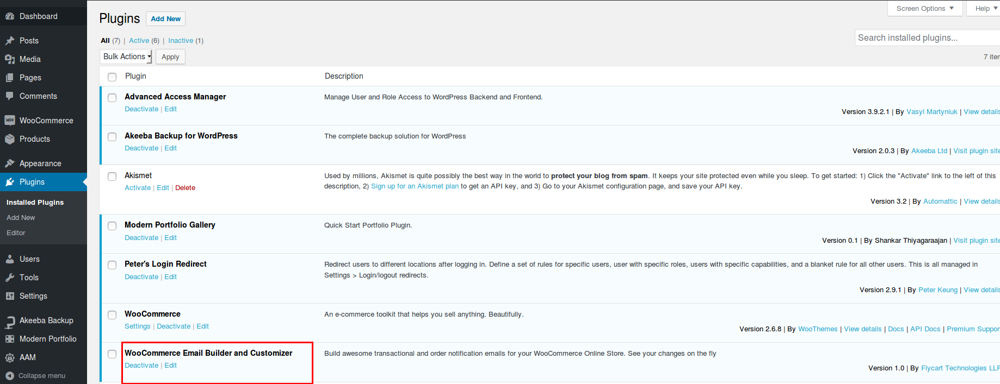
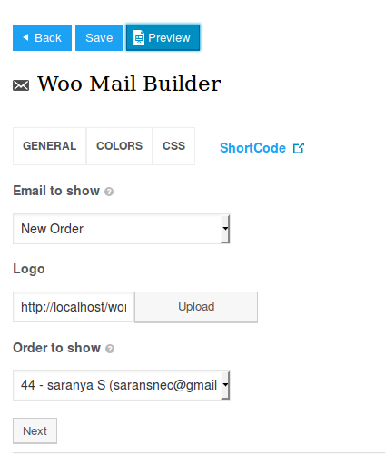
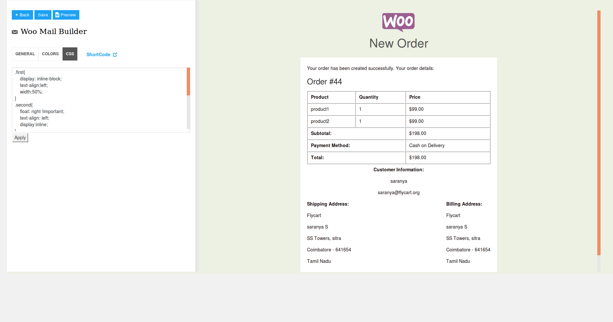
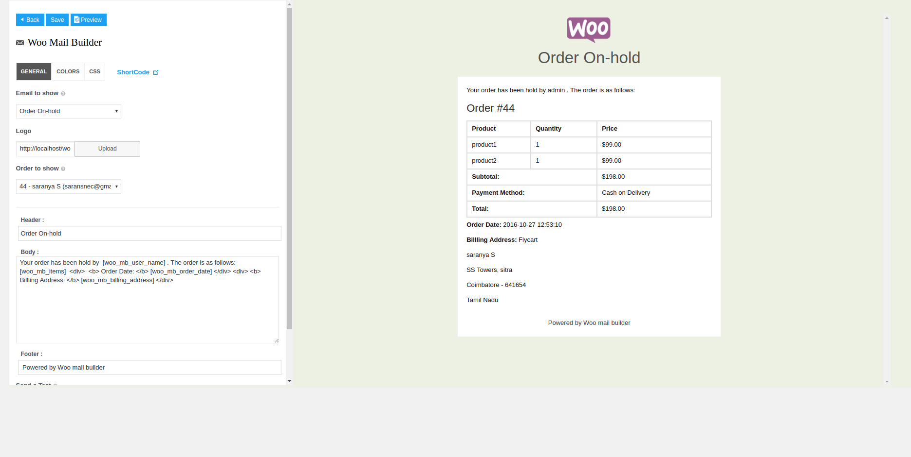
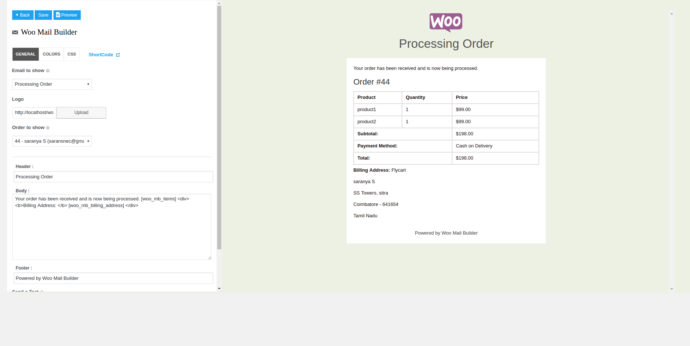
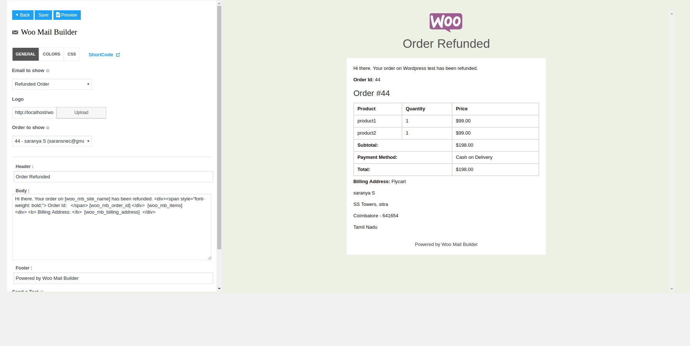
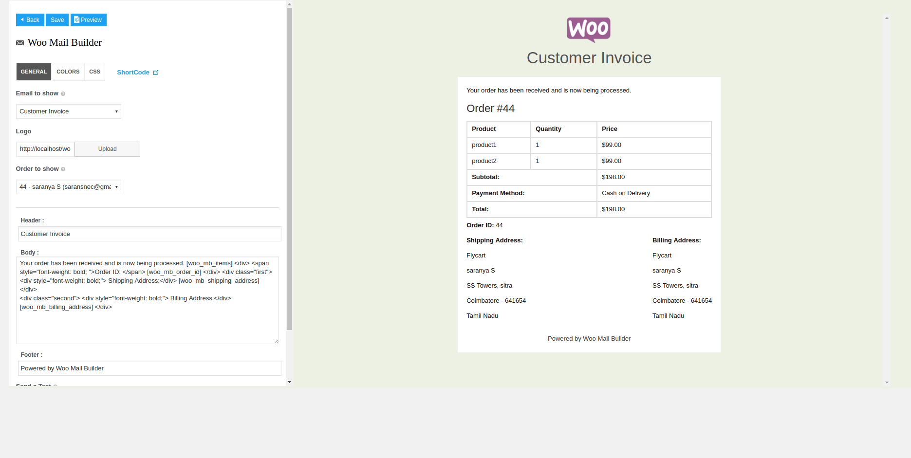
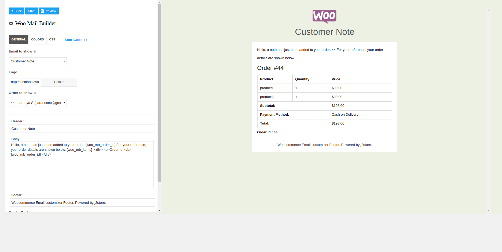
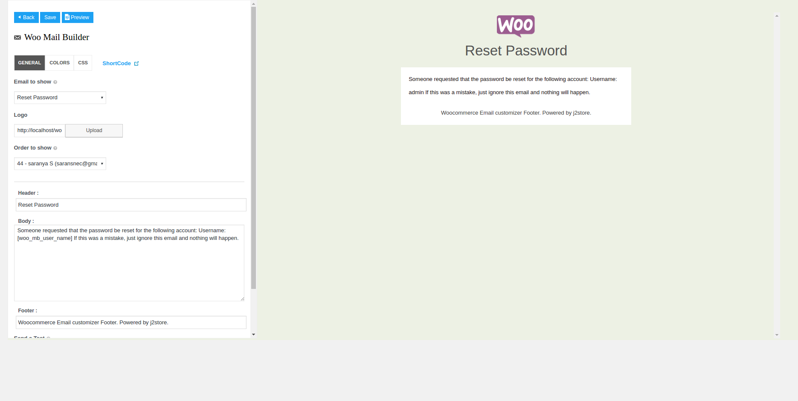

# Woocommerce Email Builder

Now enjoy sending customized stylish order email with woocommerce email builder. With woocommerce email builder you can send order email for different order status including dynamic information about product and order. Dynamic information can be added using shortcodes. You can send email templates for following cases,

* New order
* Order cancelling
* Failed order
* Order On-hold
* Processing order
* Confirmed or Completed order
* Refunded order
* Sending customer invoice
* Customer note
* Password Reset
* New account Registration

#### Requirements

1. PHP version 5.6 or greater
2. Wordpress 4.1 or higher
3. Woocommerce 2.5 or higher

#### Installation

1. Download Woocommerce Email Builder and install it using wordpress plugin installer.

2. After installing plugin, go to Plugins -> Inst-installalled Plugins and activate Woocommerce Email Builder.

3. Once installed and activated, in wordpress dashboard go to Woocommerce > Email Customizer and start creating your email.

#### Basic Configuration

From wordpress dashboard go to Woocommerce > Email Customizer and open woocommerce email builder.

Navigate to the **General tab**

#### General

**Email to show**

Select your email template from the available list of 11 different email templates. For example if you would like to send an email to the customer whose order status is changed from processes to completed, then choose the template **Complete Order**.

**Logo**

Upload your store logo here.

**Order to show**

Choose the order to which you would like to send an email notification.

Once finished filling above fields, click **Next** to load the default content. Clicking on button **Next** will show you the email template with default content and colours. You can change header, body and footer text as your wish.

**Header**

It is the header part of the email template. You can enter your header text here. For example, in our case, say **Order Completed**.

**Body**

By default, the body section loads default content of the email template you have chosen above. You can change the content with your own text and you can also use short codes to show the dynamic information about order.

On left side of the page, you can see the link named "**Short Code**". Clicking on that link will show you all the short codes.

**Footer**

It is the footer part of the email template. You can enter your footer text here. For example, you can add your site name here. Use this short code to add your site name [woo_mb_site_name].

**Send a Test**

This option is to send a test email. You can add multiple email address in a comma (,) separated format.

Click **Save** after filling these details and move to tab **COLORS**

#### Colors

Style your email template with colours.

**Background**

It is the background part of your email template. Choose your background color here.

**Body color**

It is the email body section. Choose your body color here.

**Base color**

It is the base part (i.e. background color for the title of email template) of your email template. Choose the color for your email base section here.

**Font color**

Choose your font color for your email template.

Once choosed your email template colors and click **Save** to save the changes.

   
     Add your custom css styles in the tab css

Once finished customizing your email, click on button **Send** to send your customer.

#### Screenshots

